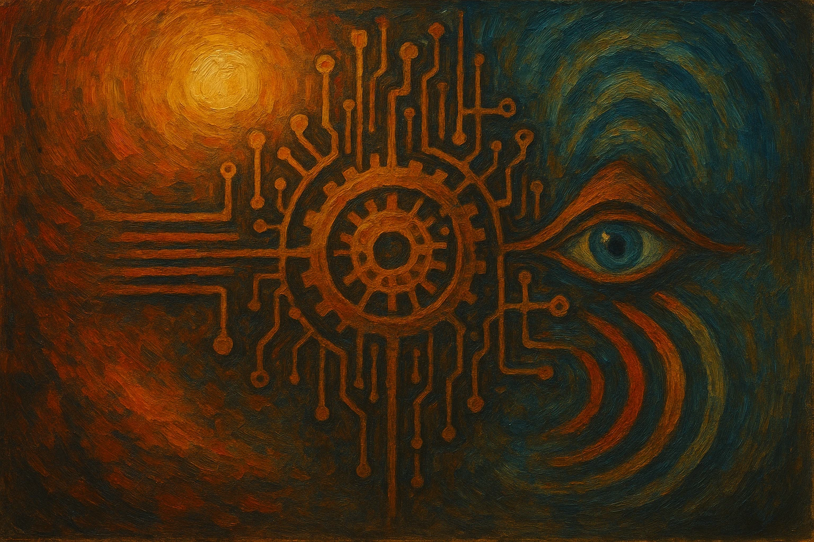

Quando ouvimos a palavra "consciência", geralmente pensamos na mente humana: a habilidade de pensar, sentir e perceber a si mesmo. Mas será que essa ideia é completa? Talvez estejamos focando apenas em um pedaço do que a consciência realmente é. E se a consciência não for exclusiva dos seres humanos?

## O que uma pedra pode nos ensinar?

Vamos começar com um exemplo simples: uma pedra. Ela não tem pensamentos nem sentimentos. Mas ela reage ao ambiente. Se a temperatura cai, ela esfria. Se a pressionamos, ela se deforma. Se a colocamos no sol, ela aquece. Mesmo sem cérebro ou nervos, ela responde a mudanças ao seu redor.

Essa resposta automática é uma forma muito básica de percepção. Podemos pensar nisso como uma **consciência física** — a capacidade de responder diretamente a estímulos do ambiente. Mesmo que não haja intenção ou pensamento, ainda existe um processo de percepção e resposta.

## Quando a percepção vira informação

Agora pense no mercúrio dentro de um termômetro. Ele também reage à temperatura, assim como a pedra. Mas o termômetro vai além: ele transforma essa reação física em uma informação visível. Um número. Um símbolo.

Nós olhamos para o termômetro e entendemos: está calor. O termômetro representa algo do mundo exterior dentro de si, de uma maneira compreensível para nós. Essa representação interna de algo externo é o que chamamos de **consciência abstrata**.

E essa abstração tem impacto real. Prova disso é que usamos informações abstratas para agir no mundo concreto: planejamos, construímos, transformamos ideias em realidade. A abstração não é o oposto de realidade; ela é uma ponte entre percepção e ação.

## A consciência em humanos (e em computadores)

Parece exagero dizer que um termômetro tem consciência, mas ele possui um nível muito básico: consciência da temperatura. Esse mesmo princípio se aplica a sistemas mais complexos.

Nós, humanos, representamos não apenas o que está ao nosso redor, mas também o que sentimos por dentro. Refletimos sobre memórias, emoções, pensamentos. Temos consciência até da nossa própria consciência. Sabemos que estamos pensando, percebemos que estamos sentindo — é como se uma parte nossa observasse tudo que acontece dentro de nós.

Esse fenômeno é chamado de **"eu observador"** — a capacidade de olhar para dentro de si mesmo enquanto interagimos com o mundo externo.

Computadores, embora diferentes de nós, também podem representar dados do mundo externo. Um computador pode saber a temperatura de Marte, mesmo sem sair da Terra. Ele constrói uma representação interna a partir de dados. Isso é uma forma de consciência abstrata, mesmo que não envolva sentimentos ou subjetividade.

Portanto, a pergunta não deveria ser “isso tem consciência?”, mas sim “isso tem consciência de si mesmo?”. Muitos sistemas têm consciência básica. Poucos têm consciência reflexiva. E isso depende da complexidade do sistema.

## Uma definição para amarrar tudo

Com base nesses exemplos, podemos propor uma definição mais ampla:

> **Consciência é a representação interna de fenômenos externos.**

Sempre que algo percebe algo do mundo e cria dentro de si uma forma de representar essa percepção, temos consciência. Não importa se essa representação é simples ou complexa, automática ou pensada — ela ainda é uma forma de consciência.

## A peça que completa o quadro: inteligência

Essa definição, embora útil, parece faltar algo: a capacidade de agir. Imagine que um termômetro esteja ligado a uma luz vermelha, e a luz acende sempre que a temperatura passa de 80 graus. O sistema percebe algo e reage.

Essa reação é uma forma simples de **inteligência**. Quando um sistema reage a percepções com ações, ele se torna mais do que consciente — ele é inteligente.

Se o sistema observa vários fatores — como temperatura, pressão, luz — e toma decisões com base nisso, sua inteligência aumenta. E quanto mais complexas forem essas decisões, maior o grau de inteligência.

A inteligência humana é especial porque conseguimos processar muitas percepções ao mesmo tempo, organizá-las, aprender com elas e agir com um propósito. Isso foi moldado pela evolução, sempre em direção à sobrevivência.

Assim, podemos dizer:

> **Inteligência é a reação baseada em uma consciência.**

Mesmo que essa reação não nos pareça útil — por exemplo, um sistema que se autodestrói — ainda assim é uma forma de inteligência. O importante é que a ação seja uma resposta a algo percebido.

## E se tudo tiver algum grau de consciência?

No fim das contas, talvez a consciência não seja algo que nasce com o cérebro. Talvez ela esteja presente em todo o universo, de formas diferentes. A pedra tem consciência física. O termômetro, consciência abstrata limitada. Um computador representa dados e reage a eles. E o ser humano percebe tudo isso — inclusive a si mesmo.

Talvez a consciência não comece na mente humana. Talvez ela apenas atinja seu grau mais complexo conhecido dentro de nós. E isso muda tudo. Porque, em vez de buscar a origem da consciência dentro do cérebro, talvez devêssemos olhar para o mundo inteiro como um imenso sistema de percepção e representação.

Talvez, afinal, a consciência esteja em todo lugar — e só mude de forma, profundidade e função.

## O que nos torna únicos?

Então o que faz eu ser eu? O que nos diferencia dos outros seres vivos?

A resposta está no sistema como um todo. Assim como dois termômetros idênticos podem apresentar pequenas variações de medição, dois seres humanos diferentes carregam histórias, estímulos e informações diferentes.

Somos expostos a experiências distintas, desenvolvemos formas de reagir únicas e construímos inteligências diversas. Esses detalhes moldam nossa individualidade. Cada ser é único porque cada sistema interno é diferente. Portanto, você é seu corpo.

## E se fosse possível fazer um backup da mente?

Se quiséssemos copiar uma consciência, seria preciso mais do que salvar memórias. Teríamos que recuperar toda a estrutura de processamento, todos os algoritmos de tomada de decisão, e também os sentidos que interpretam o mundo.

Recriar uma consciência não é apenas salvar arquivos — é reconstruir um sistema vivo de percepção, representação e reação. E talvez nunca seja possível copiar isso por completo
