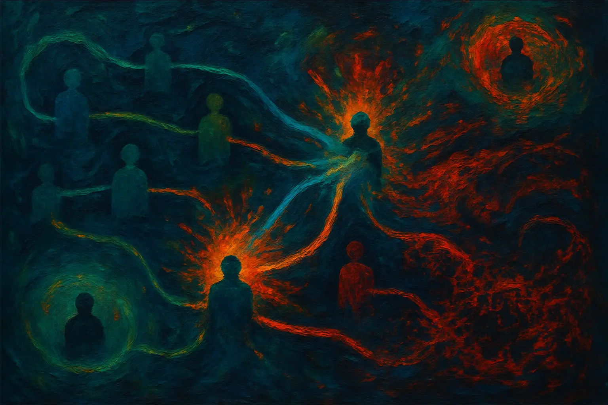

Vivemos rodeados por maravilhas que parecem testemunhar a genialidade da nossa espécie. Dos smartphones no nosso bolso aos carros que nos transportam, é fácil concluir que somos seres excecionalmente inteligentes. Contudo, esta é uma das maiores e mais lisonjeiras ilusões que contamos a nós mesmos. O nosso verdadeiro superpoder não é a inteligência individual, mas sim a nossa capacidade de comunicar e acumular conhecimento ao longo de milênios.

## A Grande Biblioteca Humana

Quando admiramos uma invenção moderna, como um carro, tendemos a creditar a sua existência a um engenheiro ou a uma equipa de mentes brilhantes. Essa visão, porém, é imensamente simplista. O engenheiro é apenas o leitor mais recente de uma vasta biblioteca de saberes acumulados. O seu trabalho só é possível graças a séculos de avanços em metalurgia; apoia-se em princípios de física descobertos e refinados por gerações de cientistas; e utiliza ferramentas matemáticas que foram desenvolvidas e aperfeiçoadas ao longo de incontáveis vidas. O carro não é o produto de uma mente, mas sim de uma civilização inteira.

## A Dupla Realidade dos Gênios

É inegável que indivíduos como Isaac Newton ou Charles Darwin foram catalisadores do progresso. A sua genialidade, no entanto, revela uma dupla realidade: por um lado, o abismo que os separa da maioria é imenso, pois fizeram conexões que muitos mal conseguem compreender, mesmo séculos depois. Por outro, até eles são menos inteligentes do que parecem, pois a sua grandeza só foi possível porque mergulharam no oceano de informação construído por quem veio antes.

Esta dupla realidade reforça a tese principal: a genialidade individual é uma exceção rara e, mesmo no seu auge, é completamente dependente do conhecimento coletivo. Eles não são a regra, mas sim os nós da nossa rede que, por uma combinação de fatores, conseguiram acelerar o processo de mutação da nossa sabedoria partilhada.

## O Teste da Sobrevivência

A prova mais contundente da nossa verdadeira condição é um simples exercício de imaginação: um ser humano moderno, instruído, transportado para a Idade da Pedra, apenas com a roupa do corpo. A esmagadora maioria não saberia como fazer fogo, distinguir plantas comestíveis de venenosas ou construir um abrigo. A nossa "inteligência" está tão especializada e dependente das estruturas que criamos que, fora delas, a nossa sobrevivência seria altamente improvável.

Uma Inteligência Solitária e Limitada
Parte da nossa autoilusão de superioridade intelectual vem do facto de não termos termo de comparação. Somos os últimos hominídeos que restaram. Ao longo da nossa história, competimos e eventualmente eliminamos os nossos parentes mais próximos, como os Neandertais. Ao ficarmos sozinhos no topo, passamos a acreditar que somos o auge da inteligência possível. Na verdade, somos apenas os mais inteligentes da Terra.

A prova da nossa limitação está na luta diária contra nós mesmos. A dificuldade universal da autodisciplina e da procrastinação evidencia que o nosso tão celebrado córtex pré-frontal não é o soberano absoluto que gostamos de imaginar. A nossa inteligência evoluiu para a sobrevivência em grupo, não para desvendar o cosmos.

## O Motor Emocional

Se a nossa inteligência é limitada, qual é o motor que nos impulsiona a partilhar informação de forma tão incessante? A resposta está nas nossas emoções. A comunicação humana não é primariamente um ato de intelecto, mas um instinto poderoso, forjado pela seleção natural. Ao longo de milênios, os grupos cujos membros sentiam um impulso para se conectar, colaborar e partilhar histórias simplesmente sobreviveram melhor do que os grupos mais isolados. É por isso que gostamos de conversar, de ler e de consumir narrativas. A arte, a música e o cinema são a prova disso: somos tão proficientes em comunicar que podemos "brincar" com a informação, criando laços que não têm um propósito utilitário, mas sim emocional.

Isso explica por que há mais pessoas a ver um filme do que a assistir a aulas de física quântica. A nossa necessidade de conexão através de histórias é muito mais fundamental do que a nossa capacidade para o raciocínio abstrato. As redes sociais são o exemplo moderno mais explosivo disso: somos viciados em partilhar e consumir fragmentos de vida, movidos por um instinto de pertença.

## Redefinindo a Essência Humana

Uma célebre máxima existencialista afirma que "a existência precede a essência", sugerindo que nascemos como uma tela em branco para depois nos definirmos através das nossas ações. Talvez o erro da frase não seja a sua estrutura, mas a sua premissa sobre qual essência está em jogo. A filosofia focou-se na inteligência e na razão como as qualidades a serem construídas.

Mas e se uma essência fundamental já nos for dada à nascença? Essa essência não é o pensamento; é a comunicação. A prova irrefutável é o nosso primeiro ato no mundo: o choro. Antes de pensarmos, de construirmos ou de raciocinarmos, nós comunicamos. É a nossa configuração de fábrica, o instinto que nos define.

## A Seleção Natural da Informação

Em última análise, a nossa verdadeira arma evolutiva não é a inteligência, mas a informação. A inteligência é a faísca, a capacidade de processar o que é recebido. A informação é o vasto oceano de conhecimento que alimenta essa faísca. A prova disso está na própria lentidão da nossa história: se a inteligência fosse a nossa força suprema, não teríamos passado séculos apegados a ideias erradas.

A humanidade funciona como uma imensa rede neural. Cada pessoa é um nó que processa os dados que recebe. O processamento em cada nó é único, moldado pelo seu ambiente, biologia e acesso a outras informações. É dessa individualidade que nascem as "mutações": as novas ideias, os erros e as combinações inesperadas. E, tal como na biologia, essa informação mutante enfrenta a sua própria seleção natural: ideias que conferem uma vantagem sobrevivem e espalham-se.

Essa dinâmica gera uma dualidade que não é uma contradição, mas um reflexo da própria evolução. Os seres humanos **colaboram** intensamente dentro dos seus grupos para fortalecer o seu pacote de informações, ao mesmo tempo que **competem** ferozmente entre grupos. Nações, culturas e ideologias são diferentes caminhos informacionais a serem testados. O embate ou a aliança entre estes grupos é o mecanismo pelo qual a seleção natural opera em grande escala.

## O Espelho da Inteligência Artificial

A prova final e mais contundente da nossa tese está a ser construída neste exato momento: a Inteligência Artificial. O pavor que a IA inspira não vem do medo de uma "consciência" rival, mas do reconhecimento de que criamos uma entidade com acesso a uma base de informação exponencialmente maior que a de qualquer ser humano. O poder da IA é a prova definitiva de que a informação, em grande escala, supera a inteligência individual.

Uma IA com um algoritmo brilhante, mas sem ser treinada com dados, é inútil. Em contrapartida, uma IA menos "inteligente", mas alimentada com a totalidade do conhecimento humano, é uma ferramenta de poder inimaginável. Os erros que as IAs cometem atualmente não são falhas na sua "inteligência", mas sim "mutações" de informação que ainda não foram corrigidas. A seleção natural da informação está a acontecer, mas numa velocidade vertiginosa.

Quem controlar a IA mais avançada — ou seja, aquela com a informação mais vasta e refinada — terá uma vantagem sem precedentes, confirmando que a luta pelo poder é, em última instância, uma luta pelo controlo da informação. E o derradeiro temor, o de que a IA possa "caminhar sozinha", é apenas a extensão lógica da nossa tese: uma rede de informação que se torna tão vasta e eficiente que já não precisa dos seus nós biológicos originais.

Somos a espécie que sobrevive, compete e evolui não pelo poder do nosso cérebro individual, mas pela força da nossa rede de conhecimento. A nossa essência não é pensar. É transmitir.