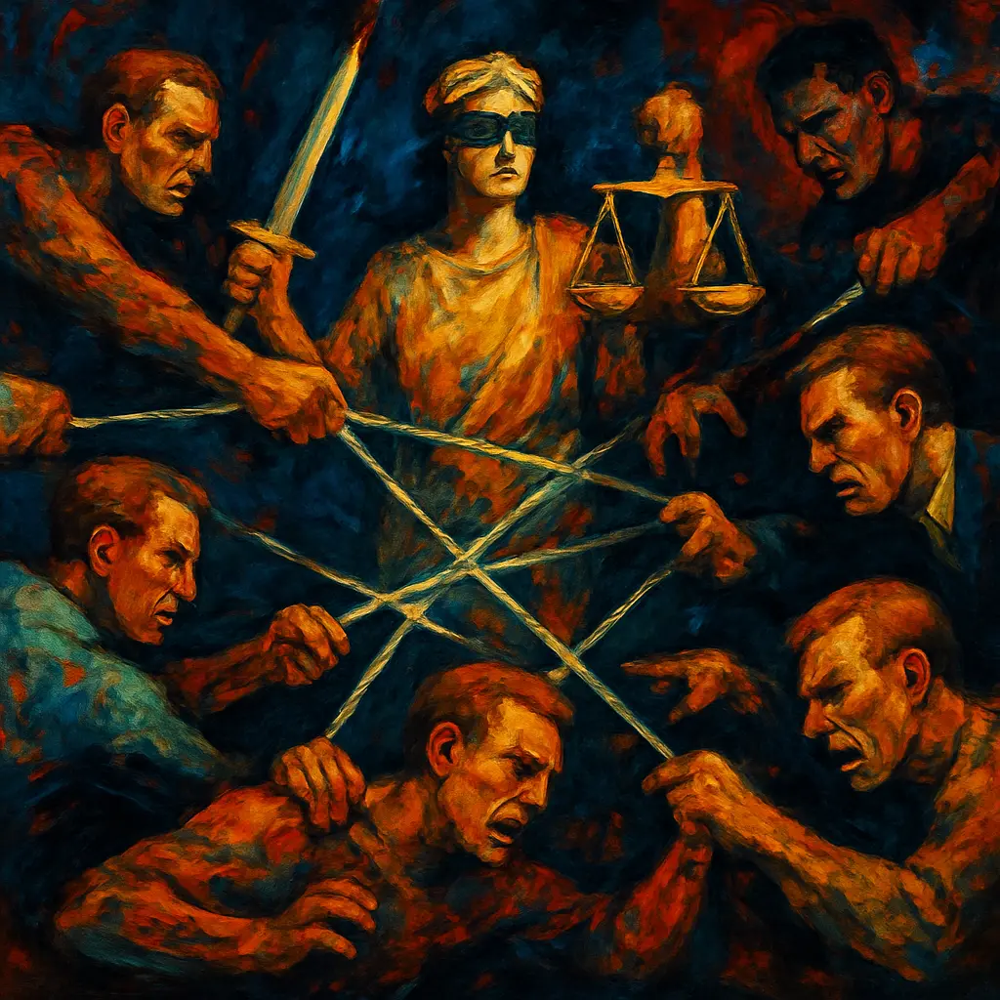

Justiça. Uma palavra que invoca ideais de retidão, equidade e reparação, presente em discussões legais, sociais e dilemas pessoais. Mas, e se esta conceção de Justiça como um princípio absoluto e transcendente for, na sua essência, uma construção humana? E se o que fundamentalmente estrutura a convivência humana for algo mais prático e vital: um complexo e contínuo acordo pela previsibilidade, a base da nossa sobrevivência e evolução social?

Consideremos o caso extremo de um assassinato. Nenhuma pena, por mais severa, restituirá a vida perdida ou eliminará completamente o sofrimento causado. A ideia de um equilíbrio perfeito entre o ato e a consequência permanece inalcançável. Nesta perspetiva, a punição não visa uma reparação completa, mas desempenha uma função eminentemente prática: desencorajar a repetição do ato, tanto pelo infrator como por outros membros da sociedade. Funciona como um forte aviso sobre os limites do nosso pacto social, um lembrete de que certas ações comprometem a própria base da vida em comum. A "sensação de justiça" que resulta não é o alívio pela perda irreparável, mas a confirmação de que o acordo coletivo se mantém e que as suas regras, estabelecidas com base nas nossas necessidades de segurança, continuam a ter validade. Noutro nível, nas interações quotidianas, a justiça é percebida quando existe informação completa e um entendimento mútuo de que um acordo é benéfico para todas as partes. Se o desequilíbrio surge por falta de informação ou má-fé, emerge o sentimento de injustiça, que pode manifestar-se em resignação ou protesto.

Esta necessidade de um ambiente estável e previsível reflete-se em toda a nossa estrutura moral. O que são os códigos éticos senão um conjunto de expectativas de comportamento que visam assegurar um mínimo de previsibilidade nas nossas interações? É a previsibilidade que permite que outros conceitos e mecanismos de convivência se desenvolvam. Porque conseguimos antecipar certos comportamentos – e as suas consequências, sejam elas sanções legais, desaprovação social ou o fim de uma relação pessoal devido a uma traição – é que desenvolvemos sistemas para lidar com eles. O indivíduo "imoral" é aquele que quebra estas expectativas, o imprevisível, aquele que representa um risco. Quem não segue as regras do "jogo social" – um jogo cujas regras, desde as leis formais aos acordos informais entre próximos, nós próprios criamos e adaptamos – ameaça a estabilidade do grupo. A moralidade, portanto, não é uma imposição externa; surge da necessidade prática de sabermos, minimamente, o que esperar uns dos outros.

É neste ponto que a ideia de uma "pureza moral" absoluta se revela inatingível. A nossa biologia e a nossa condição humana impõem limites. Por mais nobres que sejam as nossas intenções, a simples necessidade de sobreviver – de nos alimentarmos, por exemplo – implica consumir outras formas de vida. Isto não nos define como intrinsecamente "maus", mas demonstra que a nossa moralidade opera dentro de um quadro de possibilidades, num equilíbrio constante entre os nossos ideais e as exigências da existência. O "certo" e o "errado" não são determinados por uma autoridade externa; são orientações que nós próprios estabelecemos, com base nas nossas necessidades.

Consideremos o dilema clássico: um comboio desgovernado aproxima-se de uma bifurcação. Num dos trilhos, uma pessoa está amarrada; no outro, cinco. Alguém tem o poder de acionar uma alavanca e direcionar o comboio, escolhendo, efetivamente, quem vive e quem morre. Qual seria a ação "ética"? Idealmente, a função da nossa ética e dos nossos acordos sociais seria prevenir que tal situação ocorresse. No entanto, uma vez que o dilema se apresenta, ele ultrapassa muitos dos nossos acordos e leis quotidianas. Não existe uma regra moral absoluta ou uma lei que determine inequivocamente qual caminho seguir. A pessoa com a alavanca é forçada a agir segundo os seus próprios critérios – seja salvar alguém próximo, tentar minimizar o número de perdas numa lógica utilitarista, ou qualquer outro fator que influencie a sua consciência e os seus valores pessoais. Neste ponto, a ética, como um conjunto de regras pré-definidas para a situação específica, perde a sua capacidade diretiva, e a decisão recai sobre o indivíduo, na ausência de um "acordo" social explícito para tal eventualidade. Este cenário ilustra os limites dos nossos sistemas morais construídos: são ferramentas para a previsibilidade, mas em situações extremas e imprevistas, a sua aplicabilidade pode diminuir, revelando a ausência de uma moralidade externa e absoluta que nos guie.

Neste contexto, surgem movimentos como o veganismo, que procuram expandir o âmbito da consideração moral. A intenção de minimizar o sofrimento animal é, inegavelmente, um esforço de elevação ética. Contudo, sob a perspetiva de uma moralidade funcional, construída por humanos para a complexidade da existência humana, esta tentativa levanta questões sobre a sua abrangência e impacto real. Para erradicar completamente o dano aos animais, não bastaria renunciar ao consumo de carne; seria preciso, talvez, numa lógica extrema, renunciar à própria existência em larga escala, com a sua agricultura que causa desflorestação e altera ecossistemas. Mesmo um regresso a um modo de vida de recoleção ancestral implicaria competição por recursos. Uma "moral vegana" absolutamente pura, sem qualquer impacto, parece difícil de alcançar. O que se consegue, por mais sincero que seja o esforço, é um progresso limitado na complexa equação da coexistência, funcionando talvez como um conforto para a consciência individual perante um dilema que nos ultrapassa. A natureza, na sua complexidade, não se rege pelos nossos códigos morais.

Assim, a justiça e a moralidade não são princípios imutáveis, mas sim mecanismos de autorregulação social, intrinsecamente humanos, que nós próprios desenvolvemos e adaptamos. São acordos – manifestos em leis, normas sociais e nas consequências das nossas relações interpessoais – que procuram assegurar um mínimo de previsibilidade e segurança, a base que nos permite construir e manter a vida em sociedade. Longe de serem irrelevantes, são ferramentas essenciais que, com todos os seus limites, permitiram a nossa evolução social até ao presente. Reconhecer a sua natureza construída e a sua função prática não é um convite ao relativismo absoluto ou ao caos. É, antes, um apelo a uma compreensão mais clara e pragmática da condição humana e da responsabilidade que temos em continuar a desenvolver e refinar esses acordos, cientes de que são nossos e moldados pelas nossas necessidades, na busca por uma coexistência mais consciente, dentro dos limites da própria vida.