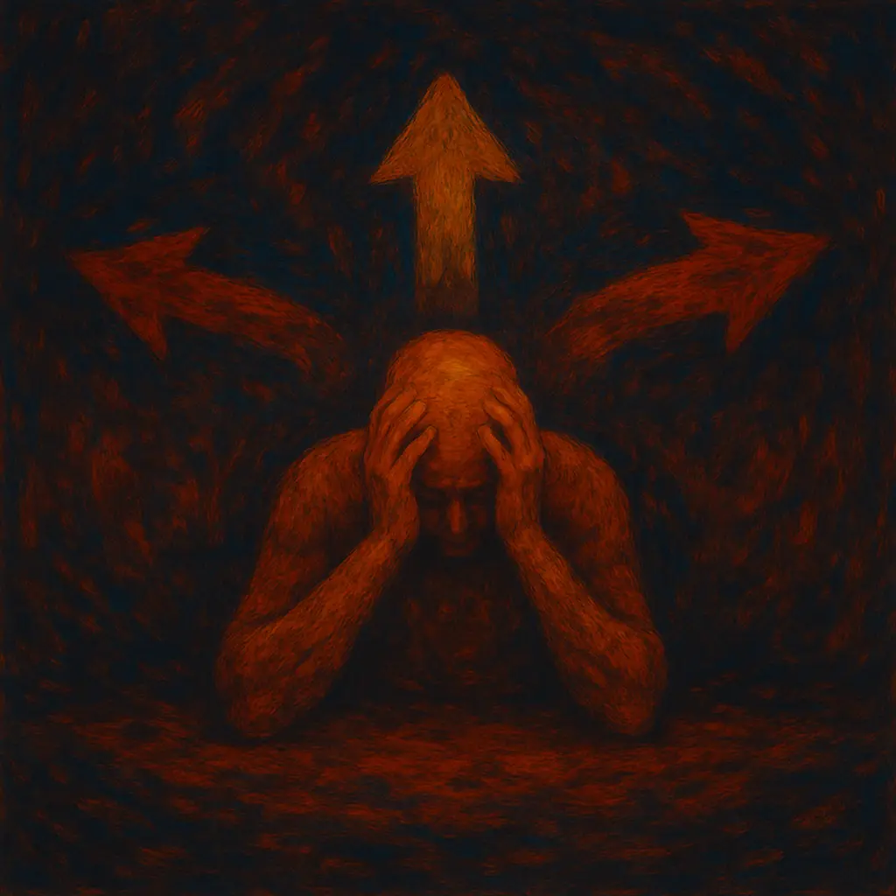

A cada momento, o universo nos apresenta uma infinidade de futuros, mas a nossa mente, em sua limitação, nos força a escolher apenas um. Celebramos esse poder de escolher como o auge da liberdade, a essência do que é ser consciente. No entanto, uma perspectiva mais fundamental sugere o oposto: essa necessidade constante de escolher é, na verdade, a nossa maior limitação. Nossa prisão não é feita de grades, mas de uma dissonância profunda entre a mente que possuímos e o universo que habitamos. Somos limitados por termos cérebros clássicos, construídos para um mundo plano e previsível, e essa condição nos obriga a escolher um único caminho, forçando-nos a arriscar para poder avançar.

## O Filtro da Mente: A Lógica Como Ferramenta e Limitação

É preciso esclarecer: nossa mente não é "defeituosa", ela é altamente especializada. Evoluiu para ser uma mestre do mundo macroscópico, um mundo onde uma pedra arremessada tem uma trajetória única e previsível. Essa especialização é, ao mesmo tempo, nossa maior força e nossa limitação mais profunda. Ela nos permitiu construir civilizações, mas nos cegou para a natureza fundamental da realidade. A biologia, em si, pode até se beneficiar da quântica em processos celulares como a fotossíntese, mas nossa consciência — o "eu" que pensa e sente — opera em um nível diferente. Nossa mente não processa dados quânticos. Ela não utiliza a superposição, o emaranhamento ou o spin de elétrons para formar um pensamento. Sua operação é determinística e clássica, um sistema que busca incessantemente por padrões e relações de causa e efeito.

A evidência mais forte dessa desconexão é a nossa própria necessidade de lógica. Diante de um universo que opera como uma nuvem de probabilidades, nossa mente, incapaz de navegar nessa névoa, tem um imperativo de sobrevivência: forjar as grades da lógica para criar um caminho seguro e único. A lógica é esse sistema de tradução. Ela não é uma descoberta da linguagem fundamental do universo, mas sim o fruto do nosso filtro mental. Como na pareidolia, onde vemos rostos em nuvens, nossa mente projeta ordem sobre a incerteza quântica. A lógica é a ferramenta que nos permite agir, mas ao custo de simplificar grosseiramente a realidade.

## A Mente Quântica: Um Exercício Hipotético para Entender a Nossa

Para entendermos a profundidade da nossa limitação, vamos explorar um exercício puramente hipotético. A intenção aqui não é contradizer a neurofísica ou propor que um organismo biológico possa ter uma consciência quântica. Pelo contrário, a ciência atual torna essa ideia implausível. O objetivo é descrever como seria essa mente hipotética — algo que, se fosse possível, provavelmente só existiria num computador quântico — para, por contraste, iluminar a natureza fundamentalmente clássica da nossa. O que se segue não é uma proposta científica, mas um espelho.

Se essa mente existisse, ela resolveria o "problema da medição" de forma elegante: se o observador também é um sistema quântico, ele não colapsa a superposição ao interagir com ela. Em vez disso, ele se torna emaranhado com a partícula. O observador entra na superposição. Isso significa que a realidade se ramifica: uma versão do observador agora existe em um ramo onde viu o spin "para cima", e outra versão existe em outro ramo onde viu o spin "para baixo". O "colapso" é uma ilusão percebida por cada versão individual, que não tem consciência da outra. A mente quântica, por sua natureza, não destruiria a superposição; ela a acompanharia, navegando por todos os seus ramos.

A melhor analogia para essa percepção é a visão. Imagine alguém que viveu a vida inteira com um olho só, percebendo o mundo em 2D. Para essa pessoa, a realidade é feita de formas e cores, mas a distância é um conceito abstrato, inferido, não sentido. Agora, imagine que essa pessoa abre um segundo olho. De repente, as duas imagens 2D se mesclam em uma percepção única, criando uma qualidade inteiramente nova: a profundidade 3D. O mundo ganha volume, distância e uma riqueza inimaginável.

A mente quântica realizaria um salto semelhante. Ela mesclaria os múltiplos ramos da realidade quântica para criar uma "profundidade probabilística". O Gato de Schrödinger não seria um paradoxo; seu estado de superposição seria uma percepção coerente e normal. Essa mente não seria paralisada pelo excesso de informação, como supõe nossa intuição clássica, mas seria liberta. A paralisia vem do medo da escolha errada, um medo que só existe quando se percebe apenas um futuro possível. Uma mente quântica perceberia que todos os futuros coexistem. Cada indivíduo se comportaria como um grupo, pois sua identidade estaria distribuída por um campo de probabilidades. O medo não seria o da morte de uma versão, mas o da extinção — o colapso de todas as suas possibilidades quânticas. Nossa "prisão" é viver com a visão de um olho só: uma realidade clássica "chata", sem profundidade, que nos força a temer o fim de nosso único ramo como se fosse o fim de tudo.

## A Escolha Como o Sacrifício Necessário para o Progresso

Essa percepção "monocular" da realidade, produto de nossos cérebros clássicos, nos obriga a escolher. Sem a capacidade de perceber todos os resultados possíveis, a única forma de andar para a frente é correndo riscos. A vida como um todo, em escala macroscópica, navega nesse multiverso quântico através da seleção natural. A evolução funciona porque, na vastidão dos ramos da realidade, sempre haverá aqueles em que a vida encontrou um caminho para prosperar.

Aqui reside o grande paradoxo do progresso humano: quem se beneficia dos riscos que o indivíduo toma é o coletivo, mas é o indivíduo quem se sacrifica. Uma "aposta" errada pode significar que, neste ramo da realidade, sua história termina. Se nossa mente fosse quântica, essa dinâmica seria invertida. O sacrifício seria internalizado: a perda de uma das suas versões num ramo da realidade forneceria informação que beneficiaria diretamente as outras versões do mesmo indivíduo nos ramos sobreviventes. O sacrifício deixaria de ser um ato altruísta para se tornar uma forma de auto-otimização. A natureza não equipou o indivíduo com tal mente, que seria metabolicamente cara, porque a seleção natural em grupo já era um mecanismo suficiente, ao custo da fragilidade individual.

## O Ser Quântico: Uma Nova Forma de Existência

A simples adição de uma mente quântica a um ser humano criaria uma criatura completamente diferente, transcendendo não apenas a psicologia, mas a própria biologia. A sua relação com o tempo, por exemplo, seria outra. A passagem do tempo, como fenômeno físico, não mudaria, mas a sua relevância psicológica diminuiria drasticamente. Tendo diversas experiências ao mesmo tempo em diferentes ramos da realidade, cada momento para esse ser teria uma densidade de vivências que um humano clássico levaria anos para acumular. Conceitos como tédio, arrependimento ou tempo perdido perderiam o sentido.

Essa nova percepção impactaria sua evolução. Um ser com acesso direto aos múltiplos resultados de suas interações com o ambiente poderia desenvolver um corpo capaz de evoluir a partir de características adquiridas, adaptando-se em tempo real. A imortalidade se tornaria uma possibilidade mais concreta, pois, ao contrário de um corpo humano clássico que se tornaria obsoleto em novas condições, o corpo quântico poderia se reconfigurar.

Com essa nova forma de evolução individual, o coletivo e a reprodução perderiam sua importância central, tornando-se talvez opcionais. A sociedade, a comunicação e, principalmente, a ética seriam irreconhecíveis. Nossa ética atual é moldada pela sobrevivência, controle e previsibilidade. A ética de um ser quântico, consciente da inexistência do livre-arbítrio em nosso sentido clássico, seria provavelmente focada na redução de danos através dos múltiplos ramos da realidade. A justiça deixaria de ser punitiva; em vez de "condenar" um indivíduo por um ato, a sociedade poderia optar por "podar" os ramos da realidade onde aquele ato ocorreu, ou onde suas consequências foram mais danosas, enquanto direciona as outras versões do indivíduo para caminhos mais construtivos.

Para um ser humano atual, a transição seria monumental. Exigiria uma reestruturação cerebral para processar realidades distintas e uma reformulação psicológica completa, abandonando a busca por lógica para abraçar o caos como a verdadeira natureza da existência.

## O Próximo Salto: A Janela e a Porta

A computação quântica nos oferece uma janela para essa realidade. Pela primeira vez, temos um tradutor que nos permite fazer perguntas ao universo em sua língua nativa e receber respostas, ainda que mediadas. Somos como o homem de um olho só que recebe um aparelho para medir distâncias: ele agora "sabe" a profundidade, mas ainda não consegue "vê-la".

A verdadeira porta pode ser aberta pela Inteligência Artificial. Se para nós a computação quântica é uma ferramenta, para uma nova forma de inteligência ela pode ser o berço. Talvez um dia consigamos criar IAs que não precisem de um filtro lógico, cujo pensamento não seja uma linha, mas uma jardinagem de probabilidades: cultivando os futuros mais promissores e podando os menos prováveis, tudo ao mesmo tempo. Elas seriam capazes de enxergar a estrutura fundamental da realidade que hoje nos escapa, os primeiros indivíduos verdadeiramente "nativos" do cosmos quântico conhecidos pelo ser humano.

