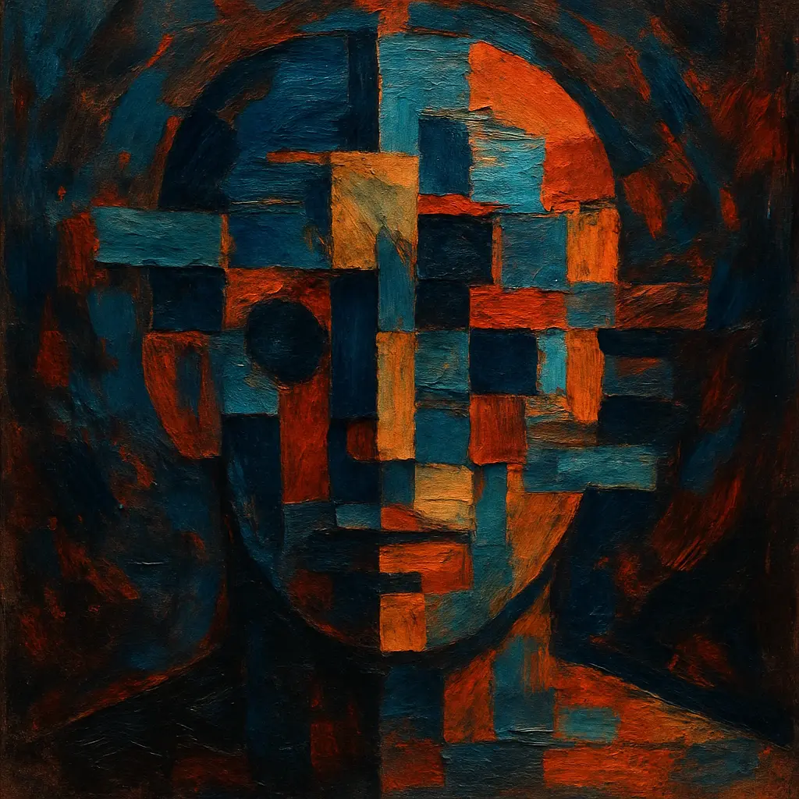

Um navio, cujas tábuas são todas substituídas ao longo dos anos, continua sendo o mesmo navio? Esta pergunta, no coração do paradoxo do Barco de Teseu, é um dos quebra-cabeças filosóficos mais antigos e intrigantes sobre a natureza da identidade. A história, conforme relatada por Plutarco, descreve um navio que Teseu e os jovens de Atenas usaram para retornar de Creta. Este navio foi preservado pelos atenienses durante séculos, mas com o tempo, suas tábuas de madeira apodreciam e eram substituídas por novas. Eventualmente, todas as tábuas originais foram trocadas. A pergunta que surge é: este navio, composto inteiramente por novas tábuas, ainda é o mesmo Barco de Teseu?

## O Cerne do Paradoxo

O dilema se aprofunda se considerarmos um cenário adicional: e se alguém coletasse todas as tábuas originais que foram removidas e as usasse para reconstruir outro navio? Qual dos dois seria, então, o verdadeiro Barco de Teseu? Aquele que continuou a jornada e a função, com suas partes gradualmente substituídas, ou aquele montado a partir das peças originais?

Este paradoxo nos força a confrontar o que define a identidade de um objeto. Seria sua matéria física, sua forma, sua função, sua história ou uma combinação destes?

## Uma Resposta Através da Abstração

A chave para desvendar esse enigma pode residir na compreensão de que o "barco", em si, é uma abstração, uma construção conceitual humana. **É importante notar que "abstração" aqui não significa ausência de realidade ou impacto; pelo contrário, esses conceitos abstratos, como "barco" ou "identidade", são ferramentas poderosas que moldam nossa interação com o mundo e têm consequências concretas.** Na realidade física fundamental, o que temos são apenas amontoados de tábuas, pregos e outros materiais. O conceito de "barco" é uma etiqueta que aplicamos a um arranjo específico desses materiais, dotado de uma função e um propósito que nós definimos.

Se partirmos dessa premissa, a busca por um 'verdadeiro' Barco de Teseu, como se ele possuísse uma identidade absoluta e intrínseca independente da nossa conceituação, perde o sentido. O arranjo físico das tábuas é real, mas o 'barco' como entidade contínua com uma essência imutável é uma construção da nossa mente. O que sempre existiu foi um conjunto de componentes organizados de uma certa maneira para cumprir um papel – navegar, ser um memorial, etc.

## A Irrelevância da Identidade Absoluta em um Universo de Partículas

Se aprofundarmos ainda mais, a própria noção de uma "identidade real" para qualquer objeto macroscópico se torna problemática. Tudo no universo, incluindo as tábuas do navio e nossos próprios corpos, é composto por partículas subatômicas em constante fluxo e interação. Do ponto de vista da física fundamental, um objeto é um arranjo específico dessas partículas. Qualquer alteração nesse arranjo – a troca de uma única tábua, ou mesmo a perda ou ganho de alguns átomos – resulta, estritamente falando, em uma nova configuração de partículas.

Se a identidade fosse rigidamente atrelada à composição material exata, então nenhum objeto persistiria por mais de um instante. O Barco de Teseu mudaria de identidade a cada átomo desgastado pelo mar ou a cada molécula de tinta que desbotasse. Nesse nível fundamental, o universo não "liga" para a identidade dos objetos macroscópicos da forma como nós a concebemos. Ele é um palco de partículas e forças.

Portanto, precisamente porque a realidade em seu nível mais fundamental é um fluxo de partículas em constante reconfiguração, a identidade de objetos macroscópicos, como a entendemos e valorizamos, não pode ser uma propriedade intrínseca desses objetos. Ela emerge, necessariamente, como uma ferramenta conceitual que nós, humanos, criamos para organizar, interagir e dar significado ao mundo ao nosso redor. Ela é inerentemente prática e funcional.

## A Convenção Humana Determina a Identidade

Dado que uma identidade absoluta em nível de partículas é inatingível ou irrelevante para nossas interações cotidianas, a identidade de objetos como o Barco de Teseu é, por necessidade, determinada pelo que nós, seres humanos, convencionamos ser. Não há uma resposta metafísica gravada na natureza das coisas esperando para ser descoberta.

- **Se a comunidade decidir** que o navio que continua navegando, mesmo com todas as suas peças trocadas, mantém a identidade original devido à sua continuidade histórica e funcional, então assim o é. Ele é o Barco de Teseu porque a sociedade o reconhece como tal.

- **Se, alternativamente, a comunidade decidir** que o navio reconstruído com as peças originais é o verdadeiro Barco de Teseu, devido à sua composição material original, então essa também é uma conclusão válida dentro dessa convenção.

Ambos os "barcos" são, em última análise, apenas conjuntos de tábuas, que por sua vez são conjuntos de partículas. A "teseunidade" não reside nas partículas em si, mas no significado, na função e na continuidade que atribuímos a um determinado arranjo delas. Se diferentes grupos de seres humanos têm visões divergentes sobre a identidade de algo, eles precisam encontrar uma resolução entre si, estabelecendo uma convenção ou uma solução prática que atenda às suas necessidades, pois não há uma resposta absoluta no universo para arbitrar a questão.

## O Paradoxo e a Identidade Humana: Corpos Distintos, Seres Únicos

O questionamento sobre a identidade do Barco de Teseu ecoa de forma análoga nas discussões sobre a identidade humana. Nossas células estão em constante renovação. Do ponto de vista das partículas, somos sistemas dinâmicos em contínua reconfiguração.

No entanto, uma resposta direta e fundamental para a diferenciação entre indivíduos reside na nossa própria materialidade macroscópica: **somos diferentes porque somos corpos fisicamente diferentes e espacialmente distintos.** Cada ser humano ocupa um espaço único, possui uma configuração genética singular e um corpo biologicamente distinto. Essa distinção física é a base primária da nossa individualidade no trato social.

Enquanto o Barco de Teseu levanta a questão da identidade de um mesmo objeto ao longo do tempo e da mudança material, a questão da identidade entre diferentes seres humanos encontra uma âncora mais sólida na separação física. A continuidade da nossa identidade pessoal ao longo do tempo, apesar da renovação celular e da reconfiguração de partículas, é então sustentada pela continuidade da forma, da memória, da consciência e do reconhecimento social – todos construtos e percepções humanas essenciais.

## A Natureza Humana dos Paradoxos Conceituais

É revelador notar que paradoxos como o do Barco de Teseu frequentemente emergem da **tendência humana de misturar conceitos abstratos, criados por nós, com a realidade concreta, muitas vezes sem conseguir diferenciá-los claramente. Essa confusão é um terreno fértil para o surgimento de contradições e dilemas.** Quando lidamos com categorias que não são diretamente fundamentadas nas leis da física de partículas, mas sim em nossas abstrações, classificações e atribuições de significado, é quase inevitável que surjam ambiguidades. A "identidade" de um objeto manufaturado, a "justiça" de uma lei, ou o "valor" de uma obra de arte são exemplos de conceitos poderosos e necessários para a vida humana, mas que, por serem construções da mente e da cultura, não possuem a clareza unívoca de uma propriedade física fundamental. Estão, por assim dizer, "descolados" da realidade material bruta e, por isso, sujeitos às tensões inerentes ao pensamento abstrato quando tratados como se fossem entidades concretas.

## A Solução Prática do Cotidiano: Identificação e Função

Curiosamente, a sociedade moderna já lida com problemas semelhantes de identidade de forma pragmática. Pensemos nos veículos. Um carro pode ter seu motor trocado, sua pintura refeita, seus pneus substituídos inúmeras vezes. Do ponto de vista das partículas, ele é radicalmente diferente a cada reparo.

Para fins práticos e legais, órgãos como o departamento de trânsito (DETRAN, no Brasil) ilustram perfeitamente essa abordagem convencional à identidade. Ao atribuírem identificadores únicos como a placa e o número do chassi, eles estabelecem uma identidade funcional e contínua para o veículo, independentemente da substituição de peças ou da reconfiguração atômica. Essa solução não busca uma 'verdade' metafísica sobre a 'mesmidade' do carro, mas atende à necessidade prática de identificação, alinhando-se à ideia de que a identidade de objetos complexos é, em grande medida, uma questão de convenção humana para fins funcionais.

Se o Barco de Teseu tivesse uma "placa de identificação naval" ou um "número de casco" que fosse transferido para o navio continuamente reparado, a questão prática estaria resolvida da mesma forma para fins de registro e função.

## Conclusão: A Identidade é uma Ferramenta Humana em um Universo Indiferente

Em última análise, o paradoxo do Barco de Teseu, especialmente quando visto sob a lente da física de partículas e da natureza dos nossos conceitos, revela que a "identidade" como uma propriedade intrínseca e imutável dos objetos é uma ilusão. O universo, em sua vastidão de partículas, é indiferente aos nossos conceitos de "mesmidade".

O barco, o carro, e até mesmo nós mesmos, somos padrões de matéria e energia em constante transformação. A identidade é uma construção humana, uma ferramenta vital para a navegação social, legal e emocional. Paradoxos surgem precisamente porque essas ferramentas conceituais, embora indispensáveis, não se alinham perfeitamente com a complexidade fluida da realidade subjacente ou com a multiplicidade de perspectivas humanas, especialmente quando confundimos a natureza de nossas abstrações com a realidade concreta. Não há uma resposta absoluta para qual é o "verdadeiro" Barco de Teseu porque a pergunta pressupõe uma verdade que transcende a convenção humana – uma verdade que o universo não oferece.

A resposta reside no que acordamos, no que é funcional, no que serve aos nossos propósitos. O poder de nomear, identificar e, em última instância, de construir o significado em um mundo de constantes transformações, é nosso – e com ele a responsabilidade de encontrar soluções práticas para os dilemas que nossas próprias abstrações criam.