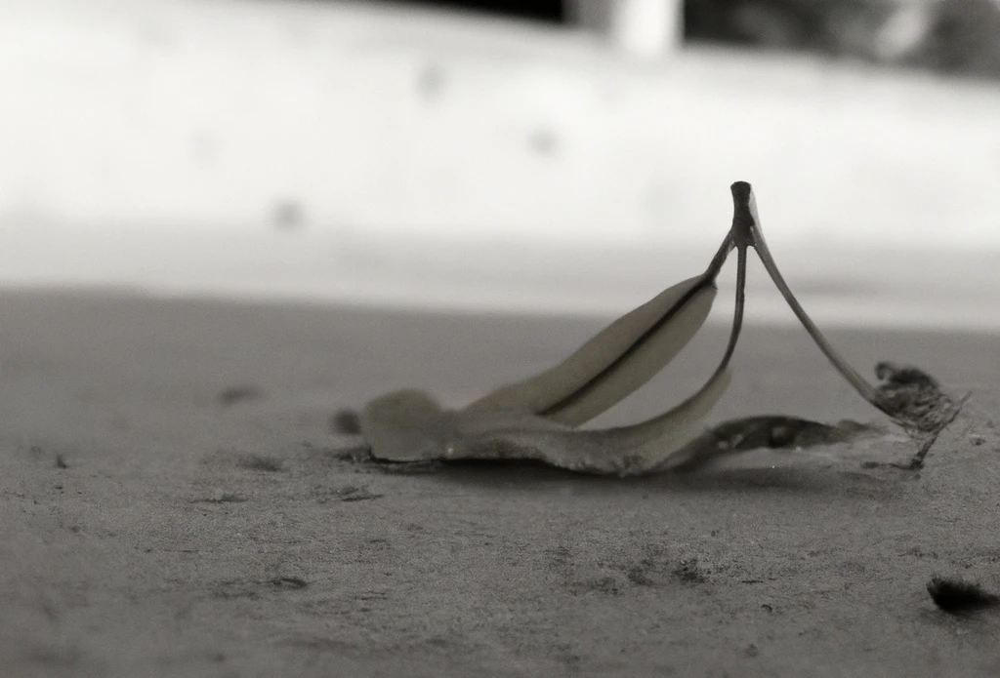

A vida é uma ilusão da mente humana.

Esta pergunta é uma daquelas que a humanidade tenta responder há milhares de anos. As pessoas oferecem respostas  de várias maneiras, mas, na maioria das vezes, elas não são objetivas. Há respostas mais filosóficas, mais  científicas e até mesmo mais emocionais, falando sobre as maravilhas da vida. Neste texto, tentarei ser frio,  cético e pragmático com esta pergunta, tentando me aproximar mais do centro da pergunta e desfazendo o viés  humano. Dessa forma, a resposta não será convencional.

Para começar, "vida" é um conceito e uma palavra criada por seres humanos. Eles atribuíram significado para esse termo. Portanto, sim, é importante explorarmos as diferentes respostas que as pessoas oferecem ao longo do tempo. Então, vamos lá.

## De um ponto de vista científico

> A qualidade que distingue um ser funcional e vital de um corpo não vivente ou pura e simplesmente da matéria química.

> O estado de um complexo material ou indivíduo, caracterizado pela capacidade de executar certas funcionalidades incluindo metabolismo, crescimento e reprodução.

> A sequência de experiências mentais e físicas que constituem a existência de um indivíduo.

Este texto, retirado do site [Wikibooks](https://pt.wikibooks.org/wiki/Biologia_celular/O_que_é_a_vida), acessado em 13 de janeiro de 2023, sem dúvida, é o ponto de vista mais simples. Isso porque ele tenta ser o mais objetivo e também utiliza argumentos lógicos para elaborar a definição, o que facilita o entendimento da maioria.

Em meio científico, o objetivo de fazer tal pergunta é ter o máximo de domínio possível sobre o assunto. E geralmente, quando se sabe que tal domínio foi alcançado, é quando conseguimos reproduzir tal fenômeno em laboratório. Porém, apenas com essas definições, ainda não conseguimos tudo. Então, falta alguma coisa.

## De um ponto de vista emotivo

> A vida é uma aventura: viva, sinta, ame, ria, chore, brinque, ganhe, perca, tropece, mas sempre levante-se e siga.

> A vida é uma sala de tortura, da qual somente sairemos mortos.

> A vida é saber segurar o guarda-chuva quando chove.

Essas definições, retiradas do site [A mente é maravilhosa](https://amenteemaravilhosa.com.br/o-que-e-a-vida/), acessado em 13 de janeiro de 2023, trazem definições de maneira subjetiva, onde cada pessoa que trouxe uma resposta se baseou no dia a dia humano ou em experiências próprias. Onde a vida não é mais uma coisa ou um fenômeno, são metáforas onde o ser humano é o centro da definição.

Porém, essas definições não nos aproximam do centro da pergunta, elas acabam nos distanciando. Aceitando que não vamos conseguir preencher o vazio que essa pergunta traz. Desta forma, não se pode ter como referência para, de fato, responder a pergunta. Este não é o caminho para avançarmos realmente no entendimento do conceito.

## De um ponto de vista filosófico

Platão argumentava que a vida tem um propósito moral e espiritual e que a verdadeira realização na vida vem da busca da sabedoria e do conhecimento das coisas ideais.

Aristóteles, por outro lado, argumentava que o objetivo da vida é alcançar a felicidade, ou a "eudaimonia", através da realização de nossas faculdades humanas naturais, como a razão e a virtude.

O filósofo existencialista Jean-Paul Sartre argumentou que a vida não tem um propósito ou significado intrínseco e que é a responsabilidade do indivíduo dar significado à sua própria existência.

Outros pensadores, como Nietzsche, Heidegger e Camus, também propuseram suas próprias interpretações sobre o significado da vida. Mas esses são apenas alguns exemplos de como a filosofia tem abordado o conceito de vida.

Então, podemos ver que a filosofia é um campo aberto para essa definição. Ela mistura tanto conceitos mais emocionais quanto racionais para tentar descrever a vida. Tentando atacar o problema de ângulos diferentes, cada um seguindo um caminho diferente para tal. Talvez este seja um caminho onde podemos nos aproximar mais da definição central, porque tenta usar todos os recursos que temos.

## Avançando no conceito

Vimos que, se reunirmos os conceitos que temos sobre a vida, ainda não conseguimos definir com exatidão o que é e nem conseguimos ter total domínio sobre o assunto, pois há inconsistências. Vimos também que existem duas principais direções ao tentar definir a vida: um conceito biológico e um conceito humano, mais filosófico. Então, venho aqui propor um avanço.

A proposta que quero trazer é que, na verdade, a vida é uma ilusão da mente humana e que não existe vida na realidade. E dentre o conceito biológico e filosófico, eu me refiro aos dois.

Existe um paradoxo citado por alguns filósofos, como Heráclito, Sócrates, Platão, entre outros, que se chama "Navio de Teseu". Para quem não conhece, o paradoxo diz:

>Se eu tiver um navio de madeira e precisar trocar tábuas para preservá-lo, à medida que ele se deteriora, um dia eu teria diversas tábuas retiradas do navio e o navio montado não teria mais nenhuma da qual ele foi fabricado. Eu poderia usar as tábuas retiradas e construir um novo navio. Desta forma, eu teria 2 navios: um montado com as tábuas retiradas, que são as originais do navio, e outro, com as tábuas substituídas. A questão é: qual é o navio original?

"E o que esse paradoxo tem a ver com a definição de vida? Se uma vida é composta por átomos ou células, assim como um navio é composto por tábuas, através desse paradoxo, podemos fazer uma analogia entre vida e navio. E se pararmos para pensar, também não existe navio. Um navio é apenas um amontoado de tábuas que boia, e o ser humano decidiu chamá-lo de navio. Mas no fundo, é apenas uma ilusão da mente humana, são apenas tábuas, assim como a vida é apenas átomos.

Da mesma forma, se foi o ser humano quem denominou aquele amontoado de tábuas como "navio", ele também pode decidir qual navio é o original. Ele criou os critérios para definir o que é um navio, assim como também pode criar critérios para decidir qual é a vida original. Isso já foi resolvido, de uma maneira muito sutil, e que poucos relacionam, mas hoje nós conseguimos identificar navios, assim como carros. O ser humano já criou critérios para identificar veículos como placas, número do chassi, dentre outros detalhes.

Se a vida também é um conceito criado por seres humanos, então eles podem usar os critérios que bem entenderem. Isso significa que todas as definições estão corretas, pois foram criadas por seres humanos. No entanto, isso gera um problema de inconsistência, pois se cada um pode ter sua própria definição, como podemos enxergar a realidade? É necessário remover o viés humano para alcançar uma compreensão mais precisa.

## Removendo o viés humano

Neste ponto, precisamos ter cuidado, pois não dá para discutir essa ideia sem fazer uso da linguagem, e a linguagem também foi criada por seres humanos, o que pode trazer distorções no pensamento. Se começarmos a desconstruir conceitos como navios, vida e outros, iremos chegar a tábuas, células, átomos, energia e ainda mais profundamente, conforme a ciência consegue ir. Mas não necessariamente precisamos ir tão fundo, podemos usar essa ferramenta apenas para avançar quando for necessário, por exemplo, de navio para tábuas, de célula para átomo. Ou seja, quebrar apenas o objeto de estudo, que nesse caso será a vida. Assim não ficamos sem recursos linguísticos para discutir sobre o assunto.

O grande problema com esse conceito, na verdade, é a linguagem, que nos impõe o viés humano para discutir determinados assuntos, tornando mais difícil se aprofundar em conceitos e chegar à raiz da dúvida. Isso também nos faz acreditar que existe diferença entre algo vivo e algo não vivo, pois são conceitos diferentes. Podemos achar que uma pedra não é vida porque não se enquadra nas definições, mas talvez seja e estamos nos limitando por conceitos linguísticos. Se começarmos a considerar que a vida não se difere muito de pedras, pois ambas são um amontoado de átomos, fica mais fácil de imaginar sua origem, pois as pedras têm uma origem mais fácil de entender. Assim, não precisamos imaginar que foi um evento mágico que transformou átomos inanimados em um ser vivo.

Hoje, o ser humano já não se enxerga tanto como o centro do universo, como era na Idade Média. E com esse pensamento de não sermos tão diferentes de pedras, pode nos deixar ainda menos especiais. Isso é importante, pois no fundo, ainda temos a esperança de que a vida tenha algum propósito, ou de sermos especiais de alguma forma. Mas tudo isso é uma ilusão, são mecanismos que nosso cérebro adquiriu para perpetuarmos a espécie.

### Questionamentos

É claro que essa ideia traz outras dúvidas, como "Mas o que nos faz tomar decisões?", 'Por que somos animados e corremos atrás de nos alimentar?' e 'Onde está o limite entre vivo e não vivo?'. Mas essas perguntas não são tão difíceis de responder

#### Mas o que nos faz tomar decisões?

A verdade é que não tomamos decisões. Seguindo essa linha, não temos livre-arbítrio. Nossas atitudes são apenas consequências de fenômenos acontecendo em nosso corpo, reações químicas e físicas.

#### Porque somos animados, e corremos atrás de nos alimentar?

Se formos parar para pensar, as definições de vida fornecidas pela ciência não se diferem muito das definições de fogo, por exemplo. Porque ele não está longe de ter capacidade de crescimento, reprodução, respiração e sensibilidade ao ambiente, que são características atribuídas à vida. E o fogo é considerado um fenômeno da natureza, então talvez nós também sejamos.

#### Onde está o limite entre vivo, e não vivo?

A verdade é que não há diferença, somos a mesma coisa. A única diferenciação é uma definição humana, como eu havia dito. Nós, seres humanos, estabelecemos esses limites, mas na verdade eles não existem. É como as fronteiras entre países, não existem limites reais, são imaginários.

É claro que essa visão não responde à pergunta sobre a origem da vida, nem oferece uma fórmula para reproduzi-la em laboratório. Mas tenta remover as lentes embaçadas que o viés humano e a linguagem colocam na frente do conceito. Isso abre nossa mente para explorarmos pontos de vistas mais profundos no assunto.

Esse ponto de vista pragmático na análise da vida biológica também impacta a análise da vida filosófica. Um dos motivos é, como eu havia dito, que não somos mais tão especiais. Mas também podemos pensar que se criamos conceitos e nos enrolamos com eles, como é o caso do navio e também da vida, isso acontece com diversas outras coisas, inclusive com nossos conceitos filosóficos sobre a vida. E isso aprofunda a ideia de que nossa vida não tem propósito, nem sentido, somos nós quem atribuímos. E também não precisa ser propósitos bons, nem propósitos românticos e cinematográficos. Nos atribuímos propósito independentemente de nossa vontade, mesmo que conscientemente não façamos isso, nós atribuímos.