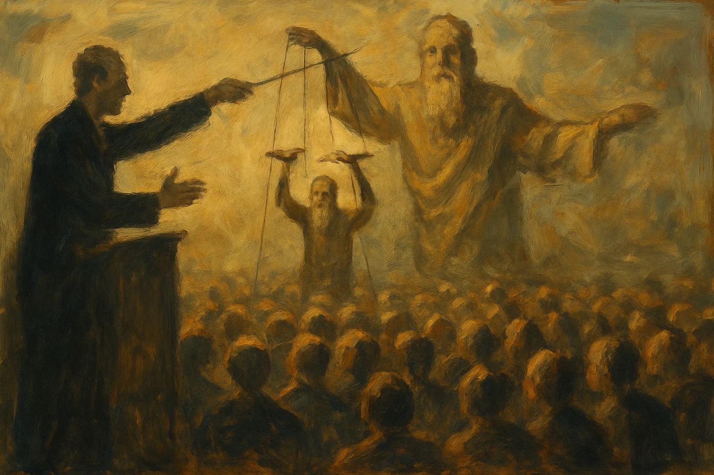

A crença em um ser divino existe há milhares de anos em diferentes culturas. Porém, quando analisamos essa ideia com base na razão e nas evidências, encontramos fraquezas importantes que merecem ser examinadas. Este artigo propõe uma análise da ideia de Deus dividida em três conceitos fundamentais: Deus como criador do universo, Deus como fonte da moral, e Deus como regente do pós-vida. Em cada uma dessas dimensões, veremos por que a ausência de crença pode ser uma posição mais coerente com o conhecimento atual.

## O Mistério das Origens

A questão sobre como surgiu o universo e toda a existência continua sendo um dos maiores mistérios da humanidade. Diante desse enigma, temos basicamente duas opções: formular hipóteses baseadas em evidências e métodos científicos, ou confiar em histórias transmitidas por gerações anteriores.

O que sabemos com certeza é que não temos certeza absoluta. Nenhum ser humano testemunhou o início de tudo, e qualquer afirmação definitiva sobre esse evento revela mais sobre nossas suposições do que sobre a realidade objetiva. A postura mais honesta seria reconhecer os limites do nosso conhecimento atual.

As investigações científicas sobre a origem do universo – como a teoria do Big Bang, baseada em observações astronômicas e cálculos matemáticos – oferecem modelos explicativos fundamentados em evidências que podemos medir. Esses modelos são provisórios e sujeitos a revisão conforme surgem novas descobertas. Diferentemente das histórias religiosas, a ciência não afirma ter conhecimento absoluto, mas avança através de aproximações sucessivas, sempre pronta a reformular suas conclusões quando confrontada com novas evidências.

O histórico de explicações religiosas sobre a origem do mundo revela um padrão preocupante: à medida que nosso conhecimento avança, essas histórias precisam ser continuamente reinterpretadas, afastando-se cada vez mais de suas versões originais. Os seis dias da criação bíblica, por exemplo, precisaram ser reinterpretados como períodos metafóricos para se ajustar às evidências geológicas e paleontológicas que mostram um universo e uma Terra muito mais antigos do que o texto sugere literalmente.

O argumento do "Deus das lacunas" – usar explicações divinas para fenômenos ainda não compreendidos cientificamente – tem se mostrado uma estratégia fadada a diminuir. À medida que o conhecimento humano avança, esse Deus recua para lacunas cada vez menores do desconhecido.

Assim, parece mais razoável admitir que nossas especulações sobre a origem de tudo são exatamente isso: especulações. Não há necessidade de transformar essas suposições em sistemas de crença rígidos. A humildade de reconhecer os limites do nosso conhecimento parece mais coerente com o estado atual da investigação humana.

## As Raízes do Comportamento Humano

A ideia de um ser cósmico todo-poderoso, que tudo sabe e está em todos os lugares, se preocupando intensamente com o comportamento de seres humanos em um pequeno planeta, a ponto de criar regras detalhadas sobre o que comer, como se vestir ou como se comportar sexualmente, mostra um grande antropocentrismo. Em um universo imenso, com bilhões de galáxias, por que nossa moral mereceria tanta atenção?

A história religiosa tradicional tenta explicar isso dizendo que fomos criados "por amor" e recebemos livre-arbítrio para que pudéssemos, por nossa própria escolha, amar a Deus em retorno. Porém, essa mesma tradição geralmente inclui o conceito de pecado original – a ideia de que toda a humanidade carrega uma culpa herdada de nossos primeiros ancestrais, resultando em um mundo de sofrimento.

Essa estrutura religiosa, quando analisada com cuidado, tem contradições sérias. Um ser que tudo sabe criaria pessoas já sabendo que elas falhariam, para depois culpar não só elas, mas todas as gerações futuras? Um ser todo-poderoso e bom não poderia criar um mundo onde livre-arbítrio e ausência do mal existissem juntos?

É importante reconhecer que a moral, de fato, é fundamental para vivermos em sociedade. Precisamos de regras e valores compartilhados para que a convivência seja possível. No entanto, isso não significa que existe necessariamente um ser divino observando cada uma de nossas ações e que um dia nos julgará por elas. A humanidade já causou inúmeros males uns aos outros ao longo da história – genocídios, escravidão, guerras, opressão – e não houve punição divina visível por esses atos. As consequências negativas dessas ações vieram de causas naturais e sociais, não de intervenções sobrenaturais.

Uma explicação mais simples é que essas histórias são criações humanas desenvolvidas para fins sociais específicos. Sistemas religiosos sempre tiveram papéis importantes na organização da sociedade, estabelecendo códigos de conduta e estruturas de autoridade. A ameaça de castigo divino e a promessa de recompensa celestial foram mecanismos eficazes de controle social em épocas em que instituições seculares eram limitadas ou não existiam.

As diferentes versões de códigos morais religiosos entre culturas e épocas sugerem sua origem humana. Se existisse um único Deus estabelecendo padrões morais universais, por que encontramos tantas versões diferentes e muitas vezes contraditórias desses padrões?

A evolução moral das sociedades humanas, muitas vezes acontecendo contra dogmas religiosos estabelecidos (como no caso da escravidão, direitos das mulheres ou direitos LGBTQ+), sugere que nossa compreensão moral vem mais da experiência humana coletiva do que de regras sobrenaturais imutáveis.

## O Grande Desconhecido

O terceiro aspecto da crença religiosa envolve ideias de alma, vida após a morte, paraíso, inferno e outros mundos sobrenaturais. Essas ideias, embora profundamente presentes em diversas culturas, não têm nenhuma evidência concreta.

Não há dados que possam ser verificados sobre a existência de uma substância imaterial que sobreviva à morte física. A consciência, pelo que a neurociência atual consegue determinar, é uma propriedade que surge da atividade cerebral. Quando o cérebro para de funcionar, tudo indica que a experiência consciente termina – parecido com o que acontece quando dormimos profundamente sem sonhar ou quando estamos sob anestesia geral.

As experiências de quase-morte, frequentemente mencionadas como evidência de algo além, podem ser explicadas por processos neurológicos conhecidos que acontecem em cérebros sob estresse extremo. O fato de certos elementos dessas experiências serem parecidos pode ser atribuído à fisiologia cerebral que todos compartilhamos, não necessariamente a vislumbres de um mundo sobrenatural.

A ideia de justiça cósmica, onde ações terrenas são recompensadas ou punidas eternamente após a morte, apresenta problemas éticos importantes. Um castigo infinito por erros finitos contradiz qualquer noção razoável de proporção. Além disso, a ideia de que seres humanos imperfeitos devam ser julgados por um padrão de perfeição impossível de alcançar parece fundamentalmente injusta.

É interessante notar que muitas tradições religiosas, incluindo interpretações corretas dos textos bíblicos originais, não apresentam as ideias populares atuais de céu e inferno eterno. Na verdade, a Bíblia não descreve claramente o inferno como um lugar de tormento eterno onde as pessoas são enviadas imediatamente após a morte. Textos como Eclesiastes 9:5 sugerem que "os mortos não sabem coisa nenhuma", e Apocalipse fala de um juízo final futuro, não de um julgamento imediato após a morte.

A doutrina bíblica da ressurreição aponta mais para um evento futuro quando, segundo essa crença, os mortos serão ressuscitados no retorno do Messias, e não para uma ida imediata para o céu ou inferno no momento da morte. Textos em 1 Tessalonicenses 4:13-18 e João 5:28-29 descrevem essa ressurreição futura, e não uma separação imediata entre "salvos" e "condenados" após a morte.

A mudança dessas ideias ao longo do tempo sugere que são construções culturais que evoluíram para atender necessidades psicológicas e sociais, não verdades reveladas imutáveis.

A explicação mais simples e coerente com as evidências disponíveis é que a morte representa o fim definitivo da experiência consciente individual. Esta conclusão, embora possa ser desconfortável, não exige pressupostos sobrenaturais ou entidades que não podemos detectar.

## Quando o Medo Substitui a Razão

A base fundamental das tradições religiosas é a fé – a capacidade de acreditar sem evidência ou mesmo contra evidências. Como muitos líderes religiosos costumam dizer, buscar provas ou justificativas racionais para crenças religiosas vai contra a própria natureza da fé.

Esta observação levanta questões importantes sobre o papel da fé nas sociedades humanas. Por que certas ideias deveriam ser aceitas justamente devido à falta de evidência que as suporte? Em que outras áreas da vida humana consideraríamos isso uma virtude?

É importante mencionar que muitas pessoas têm experiências que consideram divinas ou sobrenaturais – momentos de êxtase, sensações de presença, coincidências significativas ou experiências profundamente emocionais. No entanto, essas experiências, por mais intensas e diferentes do cotidiano que sejam, podem ter explicações que não envolvem um ser divino. Fenômenos neurológicos, estados alterados de consciência, vieses cognitivos e processos psicológicos podem explicar muitas dessas ocorrências.

O problema é que quem crê muitas vezes tem receio de buscar explicações alternativas para esses eventos, por medo de punição divina. Este medo, contudo, é essencialmente irracional – a pessoa frequentemente nem consegue definir exatamente do que está com medo, sendo mais uma pressão social e cultural do que uma conclusão pessoal. Quando alguém consegue superar esse medo inicial, geralmente encontra explicações perfeitamente razoáveis para os acontecimentos de sua vida sem precisar recorrer a intervenções divinas.

Além disso, mesmo quando não encontramos explicações imediatas para certos fenômenos ou experiências, é muito mais plausível acreditar que um dia existirá uma explicação racional e baseada em evidências do que supor que a causa seja sobrenatural. A história da humanidade é repleta de exemplos de fenômenos antes atribuídos a deuses ou espíritos (como raios, doenças, eclipses) que depois receberam explicações científicas perfeitamente compreensíveis. Essa tendência histórica sugere fortemente que os mistérios atuais seguirão o mesmo caminho, tornando cada vez menor o espaço para explicações sobrenaturais.

A exigência de fé sem questionamento como condição para a "salvação" cria uma dinâmica problemática. Ela, na prática, desencoraja o pensamento crítico e a investigação honesta, recompensando quem aceita sem questionar e punindo a dúvida sincera. Vista por esse ângulo, a estrutura de sistemas religiosos parece projetada mais para manter autoridade institucional do que para buscar a verdade.

Mesmo dentro dos parâmetros de muitas tradições religiosas, a salvação universal parece impossível. Se apenas aqueles que acreditam corretamente são salvos, a maioria da humanidade está condenada simplesmente por nascer em contextos culturais diferentes. Esta perspectiva parece incompatível com a ideia de uma divindade bondosa e justa.

É interessante notar que muitas interpretações teológicas, incluindo leituras críticas de textos bíblicos, não apoiam a visão popular de um inferno eterno. Muitos estudiosos argumentam que os textos originais sugerem algo mais próximo da aniquilação – simplesmente deixar de existir – para aqueles não "salvos", em vez de tormento eterno. Em várias passagens bíblicas, incluindo o livro de Apocalipse, a ênfase está na ressurreição e no julgamento final, não em uma separação imediata das almas após a morte.

No final das contas, a posição mais honesta intelectualmente parece ser reconhecer os limites do nosso conhecimento, junto com a disposição para oferecer explicações provisórias baseadas nas melhores evidências disponíveis. Esta abordagem não exclui reconhecer a grande importância que questões existenciais e experiências transcendentes têm para muitos seres humanos.

O questionamento crítico, longe de ser uma rejeição arrogante da sabedoria tradicional, representa a continuação da busca humana por entendimento em um universo complexo e muitas vezes confuso. Nessa perspectiva, não acreditar pode ser visto não como uma falha, mas como uma expressão de honestidade intelectual e humildade diante do desconhecido.
