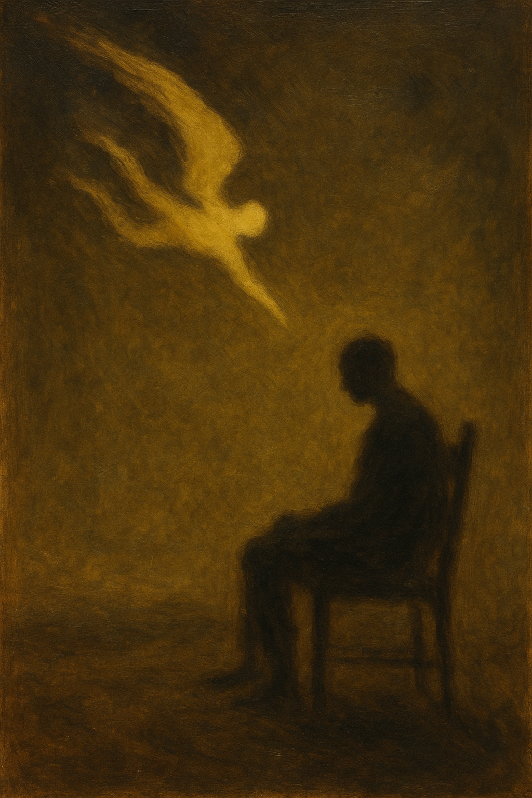

## A sala vazia e o olhar perdido

O universo é como uma imensa sala vazia. Fria, silenciosa, desprovida de qualquer sentido aparente. O niilismo é o ato de vasculhar essa sala inteira, examinar cada canto, medir sua extensão, compreender que ela é enorme, sem mobília, sem decoração, sem um bilhete de instruções pregado na parede. E então, ao final dessa análise, sentar-se no chão gelado e concluir que tudo está dito, que não há nada a ser feito, que o vazio é a resposta definitiva.

Mas essa conclusão é prematura. Faltou observar um último elemento: você.

## O observador esquecido

Existe ainda uma verdade frequentemente ignorada: o universo abstrato que construímos em nossas mentes — nossas ideias, valores, imaginação e cultura — é tão real quanto o universo concreto à nossa volta. Ele molda nossas ações, nossos vínculos e nossa forma de perceber o mundo, e tem impacto no mundo concreto. Desprezá-lo é amputar metade da realidade.

Você está dentro da sala. Você é parte do universo. E, por mais que sua existência pareça tão fria e vazia quanto o espaço ao redor, existe uma diferença fundamental: você observa. Você sente. Você pensa. Você age.

Não importa o quanto o universo pareça indiferente, ele é vivido através dos seus olhos. A realidade é mediada pela sua consciência. O niilismo esquece que, mesmo que não haja sentido intrínseco na sala, há sentido no simples fato de você estar nela, respirando, refletindo, escolhendo.

Talvez o universo nem mesmo exista — pode ser até que tudo não passe de uma simulação, um cenário ilusório montado para nos testar ou entreter. A única certeza que temos é a de que pensamos, como diria Descartes: "Penso, logo existo". Isso basta para sabermos que há algo de real em nós, mesmo que o resto seja duvidoso.

## O lar necessário

Viver no niilismo é como tentar viver na Antártica: é querer encarar o mundo extremo como ele é, cru, inóspito, sem ilusões. Mas negar que você precisa de um lar, de abrigo, de uma sociedade onde suas necessidades humanas sejam atendidas, é negar a sua própria natureza. Até mesmo os mais fortes precisam de calor para sobreviver.

O niilismo se vende como a resposta definitiva, como se tivesse desmontado a ilusão da existência e revelado o núcleo do nada. Mas essa revelação é incompleta. Não existe universo sem um observador. E nós, presos em corpos humanos, com desejos, angústias e limites próprios da nossa condição, não podemos nos dar ao luxo de viver como se fôssemos meros elementos esquecidos no fundo da sala.

Por isso, precisamos colocar a experiência humana no centro. Precisamos de um certo antropocentrismo — não por orgulho, mas por necessidade. Estamos presos em corpos humanos e precisamos existir como tal. É esse centro que nos oferece um lar: um lugar simbólico onde há calor, linguagem, cultura, afeto e sentido.

## O retorno ao centro

As pessoas são simples. Não é necessário sentir profundamente o universo para viver bem. Ele pode ser frio conosco — podemos ser frios com ele também. Não precisamos ficar hipnotizados com o abismo. Basta ter consciência de sua existência e seguir com nossas vidas. A lucidez não exige rendição.

Talvez o universo não gire em torno de você no sentido físico. Mas a sua vida, sim. E isso é mais do que suficiente para justificar sua existência.

Agora que você já conheceu as bordas do universo através do niilismo, não precisa ficar preso aí. Você pode voltar. E mesmo que ainda não tenha conhecido tudo, e queira explorar mais a fundo o niilismo, não esqueça o caminho de volta para seu lar — que é o antropocentrismo. É lá que você respira, se aquece e encontra sentido.

O niilismo pode parecer sofisticado. Mas é apenas um primeiro passo. O próximo é perceber que, mesmo na maior sala vazia, você ainda pode dançar.
