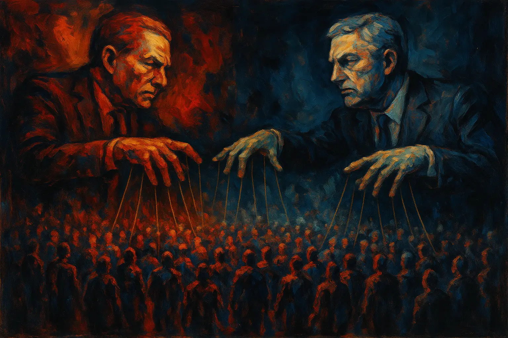

Política: já reparou como essa palavra quase sempre nos joga num Fla-Flu sem fim entre "esquerda" e "direita"? É uma briga que parece definir tudo, mas que, no fundo, muitas vezes só serve para desviar o foco do que realmente importa. Longe de querer vender a ideia de uma política fria, puramente técnica e sem alma, a provocação aqui é outra: e se pudéssemos imaginar uma política que, sem perder sua humanidade, fosse mais técnica, mais pé no chão, e realmente focada em resolver os problemas que tiram nosso sono? Seria um belo contraste com o que vemos por aí – uma arena onde, frequentemente, os interesses de poucos falam mais alto que as necessidades de muitos. No fundo, essa briga de "lados" pode nos desviar do que realmente importa: encontrar saídas para os desafios da sociedade e construir um bem-estar que alcance a todos.

## O Jogo Invertido: Quando a População Serve aos Movimentos, e Não o Contrário

Pense bem: qual deveria ser o papel de um movimento ou partido político? Idealmente, seriam nossos porta-vozes, as ferramentas para levar adiante o que a gente precisa e acredita. Só que, na prática, o que acontece muitas vezes é o oposto. Sentimo-nos quase obrigados a vestir uma camisa, a nos encaixar num desses "lados", como se a lealdade ao grupo fosse mais valiosa do que uma análise fria do que estão propondo e, principalmente, do que estão entregando de concreto.

A verdade é que cada lugar, cada tempo, tem seus próprios nós para desatar. Agarrar-se com unhas e dentes a um pacote fechado de ideias, não importa de qual "prateleira ideológica", pode simplesmente amarrar as mãos e impedir que se encontre a melhor saída. Política de verdade não deveria ser sobre defender uma sigla, mas sim sobre ter a competência de farejar os problemas e a coragem de arregaçar as mangas para resolvê-los.

## A Teia da Manipulação: Onde a Fofoca e os Ídolos Ocultam a Realidade

E como nascem esses times tão entrincheirados? Muitas vezes, são fruto de estratégias bem pensadas para nos manipular. Figuras políticas inflam as diferenças, transformam o "outro" num monstro de sete cabeças e, pronto, o circo está armado. O debate sério, aquele que poderia realmente nos levar a algum lugar, dá espaço a uma guerra de narrativas. E o resultado? **Muitos de nós acabamos mais vidrados na fofoca dos bastidores, nas trocas de farpas virtuais e na defesa apaixonada da nossa "cor", do que em buscar, juntos, soluções para os problemas que batem à nossa porta.**

O buraco, porém, é ainda mais embaixo. Talvez o sinal mais claro de que caímos numa cilada seja a devoção quase religiosa a um político específico, como se ele fosse um herói destinado a nos salvar de todos os males. Essa transferência da esperança política para uma única pessoa é um curto-circuito na nossa capacidade de pensar criticamente. Viramos torcida organizada, aplaudindo até o que não faz sentido, incapazes de ver falhas ou de exigir propostas que vão além do carisma (ou da falta dele) do nosso "escolhido".

É crucial entender que essa dinâmica de seguir cegamente não se limita à briga entre esquerda e direita. Ela vale **para qualquer rótulo: liberal, conservador, progressista, o que for. A armadilha está em se prender a um grupo a ponto de a lealdade anular o bom senso.** É essa identidade de grupo, quando levada ao extremo, que nos deixa de portas abertas para a manipulação, vulneráveis a discursos que só querem unir a "tribo", mesmo que isso custe a verdade ou a solução dos problemas. E fica o alerta: aquele político que bate no peito e se diz "do seu lado", que jura defender a "sua" causa, pode estar apenas usando essa afinidade como um degrau para chegar ou se manter no poder, sem nenhum compromisso real com o que diz ou com quem o apoia. No fim das contas, tanto os rótulos quanto os "mitos" de estimação acabam sendo um tremendo desserviço, desviando nossa energia para brigas inúteis e uma fé que não nos deixa enxergar um palmo à frente.

## Receita de Bolo para Problemas Complexos? Não Funciona!

Outra consequência perigosa dessa lógica de "times" é que podemos acabar comprando um pacote de ideias que simplesmente não resolve os nossos problemas específicos. Ora, os desafios de quem vive numa metrópole como o Rio de Janeiro são, em muitos aspectos, completamente diferentes dos de quem está em Brasília ou numa pacata cidade do interior. Querer aplicar uma solução única, vinda de uma cartilha ideológica nacional, para realidades tão distintas é como um médico que receita o mesmo remédio para todas as doenças, sem nem examinar o paciente. Problemas diferentes pedem olhares diferentes e estratégias sob medida. Uma política realmente eficaz foge das fórmulas prontas e tem a sensibilidade de criar respostas que façam sentido para cada contexto.

## Rumo a uma Política Mais Astuta: Foco nos Problemas, nos Resultados e no Respeito à Cultura

É tentador reduzir a política a um simples jogo de opiniões. E, claro, todo mundo tem o direito de ter a sua. Mas uma política que realmente transforma vai além do "eu acho". Ela se beneficiaria, e muito, de uma **postura mais técnica, com os pés fincados na realidade e o olhar voltado para resultados que melhorem a vida das pessoas.** O que isso quer dizer na prática? Que **o ponto de partida para qualquer debate político sério deveria ser uma investigação profunda sobre qual é, de fato, o problema que queremos resolver, e não uma defesa cega de soluções que já temos na cabeça ou de bandeiras ideológicas.**

Peguemos o exemplo da discussão sobre o porte de armas. Frequentemente, o debate fica patinando em preferências pessoais ou em conceitos abstratos – "o direito de se defender" versus "a cultura da paz" –, com uma avalanche de "achismos" sobre os possíveis efeitos. **Mas, qual é o problema específico que se pretende resolver com isso?** Muitas vezes, a questão central – seja a violência urbana galopante, a sensação de insegurança constante ou as falhas gritantes da segurança pública – acaba ficando em segundo plano. Em vez de se debruçar sobre a "segurança pública" com dados, diagnósticos e evidências, discute-se uma proposta de solução de forma isolada.

Em contraste, uma abordagem realmente técnica faria diferente. Se o problema identificado é o aumento de assaltos em uma comunidade, uma abordagem técnica buscaria entender as causas profundas desse fenômeno e desenharia um leque de ações (que poderiam ou não envolver a questão do armamento, mas certamente incluiriam estratégias de policiamento, inteligência, inclusão social, etc.), sempre avaliando o impacto esperado de cada uma. Se o desafio é fortalecer a democracia, as soluções passariam pelo robustecimento das instituições, pela promoção da transparência e pelo incentivo à participação cidadã.

É fundamental, no entanto, ter os pés no chão: a política, por mais técnica que se pretenda, sempre vai esbarrar em questões éticas cabeludas. E aí, meu amigo, o desafio é outro. A ética não é uma ciência exata; ela está amarrada na cultura, nos valores de um povo. Nesses momentos, a política precisa ter a humildade de reconhecer seus limites, atuando mais como uma gestora do "contrato social" ético que já existe naquela sociedade, do que como uma missionária tentando impor uma moral "superior" ou importada. Se a ética é um acordo construído coletivamente sobre o que é certo e errado para aquela comunidade, então as soluções políticas, mesmo as mais "calculadas", precisam nascer, ser validadas e funcionar dentro desse acordo.

Uma gestão política que realmente busca ser técnica age como um bom estrategista: primeiro, faz um diagnóstico preciso do problema, mergulha nos dados, analisa diferentes cenários, aprende com os erros do passado e, só então, desenha e executa um plano de ação com metas claras e resultados que possam ser medidos. O objetivo é um só: resolver a questão, e não apenas ganhar a discussão.

E quando os especialistas discordam? Aí sim, a decisão se torna mais arriscada, mas isso não é desculpa para que a opinião desinformada tome as rédeas. Pelo contrário! Se há divergência entre os técnicos, o sinal é claro: **é preciso ainda mais cautela, mais rigor, mais profundidade na análise.** É hora de arregaçar as mangas e ir mais fundo: realizar testes mais sofisticados, comparar com o que já foi feito em outros lugares, buscar novos dados, rever os métodos. A saída para o impasse técnico não é voltar à superficialidade do "achismo", mas sim intensificar a investigação até que se possa tomar uma decisão com mais clareza e com os riscos mais bem calculados.

## Desatando os Nós da Polarização: Um Convite à Reflexão para uma Mente Livre

Olhando por esse prisma, fica claro como a discussão rasa entre "esquerda" e "direita", e, pior ainda, a defesa incondicional de políticos, não nos leva a lugar nenhum. Frequentemente, essa postura apenas camufla um profundo desconhecimento sobre os desafios reais da gestão pública e serve mais como um crachá de identidade ou uma declaração de lealdade do que como um norte para ações que realmente façam a diferença. Essa polarização e o culto à personalidade na política são, muitas vezes, sintomas de uma manipulação bem orquestrada e de um pensamento engessado que nos impede de focar no que verdadeiramente importa.

É compreensível que o cenário atual possa gerar um certo desânimo. A insistência de políticos em nos manipular e a aparente lentidão para um despertar cívico mais amplo são realidades duras de engolir. **E sejamos honestos: é possível que uma parcela considerável da população jamais consiga se desvencilhar completamente dessa teia de narrativas simplistas e polarizadoras.** Lidar com essa possibilidade exige maturidade. **Por isso, a intenção deste artigo não é ditar regras sobre como as pessoas devem pensar ou agir, nem propor um modelo político frio e puramente técnico que ignore as paixões humanas. O convite aqui é para uma reflexão individual, um estímulo para quem deseja pensar por conta própria e não ser mais uma peça nesse tabuleiro de manipulações: como seria se a política, em vez de ser esse eterno cabo de guerra por interesses e poder, fosse um espaço mais dedicado a encontrar soluções inteligentes para os problemas que nos afligem? A crítica principal é ao perigo de nos agarrarmos cegamente a qualquer "time" político – seja ele qual for –, pois é essa lealdade sem questionamento que nos torna alvos fáceis.**

A boa notícia é que, mesmo num contexto tão desafiador, a busca por clareza e autonomia de pensamento é um caminho que pode e deve ser trilhado individualmente. **Quem decide olhar para a política com lentes mais críticas, para além dos rótulos e da bajulação a líderes, quem se dispõe a checar informações e a questionar as promessas vazias de quem se diz "do seu lado" apenas para se dar bem, conquista algo precioso: a sua liberdade de pensar com a própria cabeça, de mudar de rota quando preciso, e de não ser mais um prisioneiro nesse jogo.** Essa atitude é a sua bússola no meio do caos. Mesmo que não transforme o mundo da noite para o dia, ela é o alicerce para uma participação mais consciente e, mais importante, para a sua própria liberdade de pensamento.

Chegou a hora de olharmos para além das etiquetas e dos "salvadores da pátria". Precisamos exigir uma política com foco em resultados, com transparência e com a inteligência de se adaptar aos desafios. O verdadeiro avanço, tanto para cada um de nós quanto para a sociedade como um todo, acontece quando usamos o aprendizado do passado e a análise clara do presente para alimentar a coragem de pensar por nós mesmos, construindo um futuro com mais pragmatismo, responsabilidade e, acima de tudo, com a mente livre.

